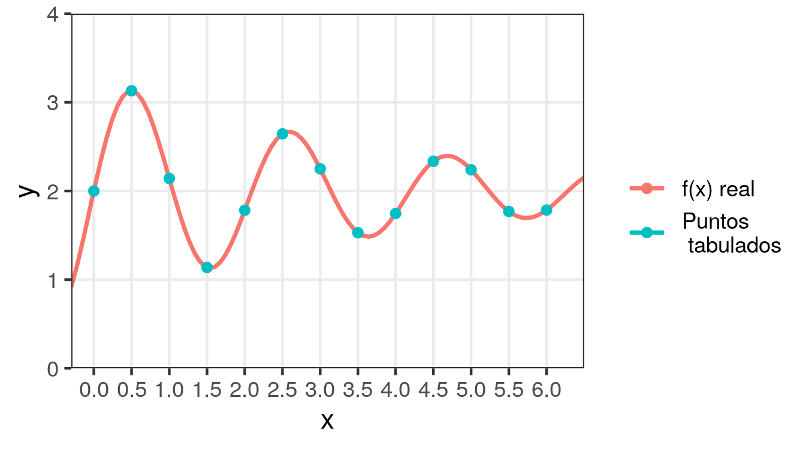
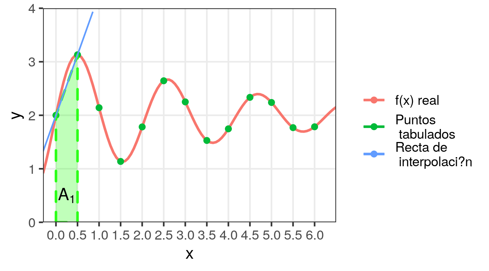
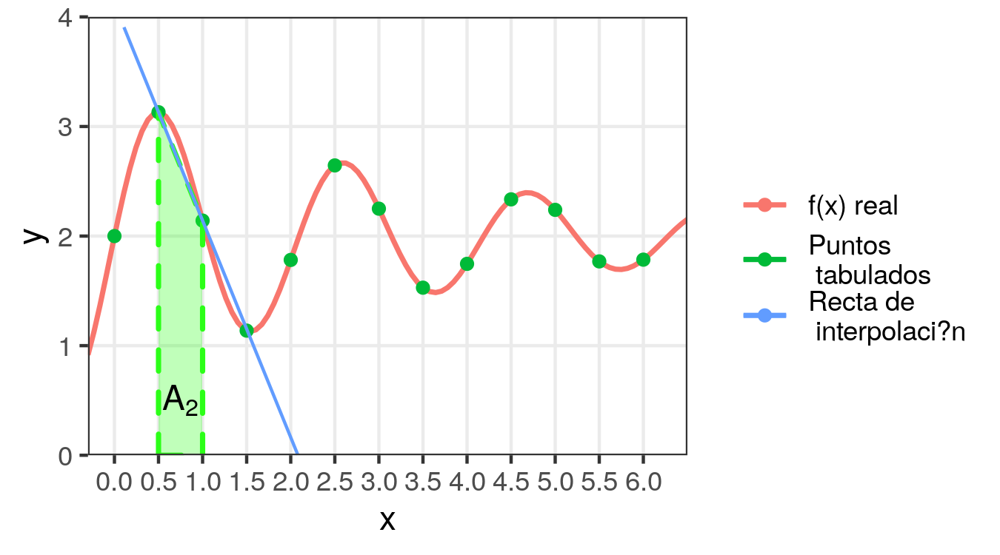
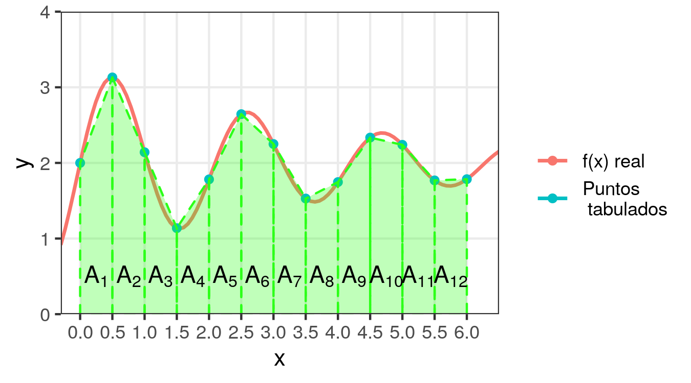
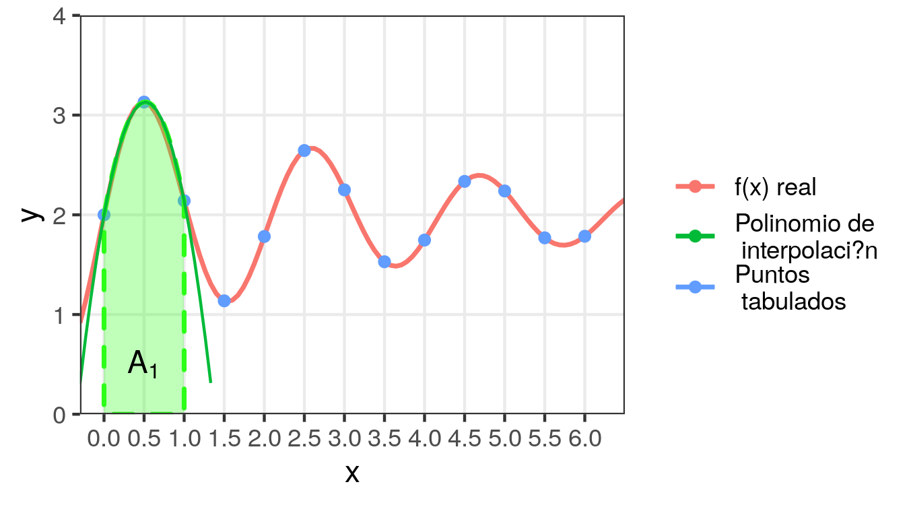
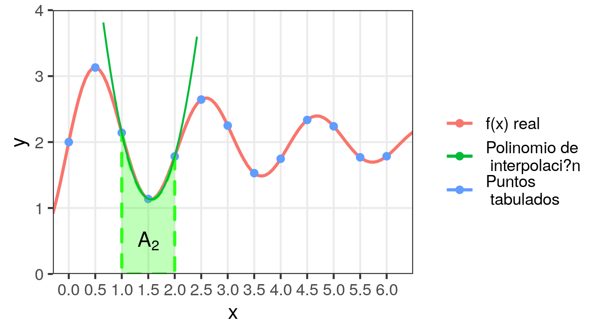
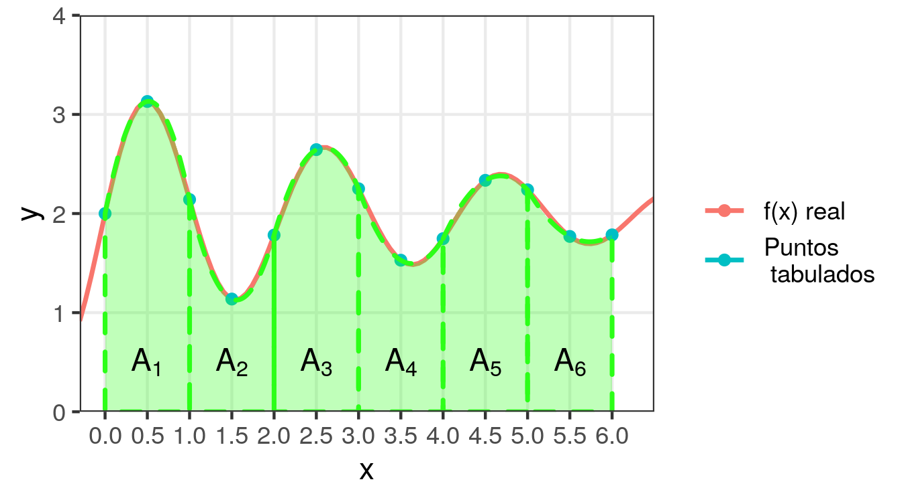
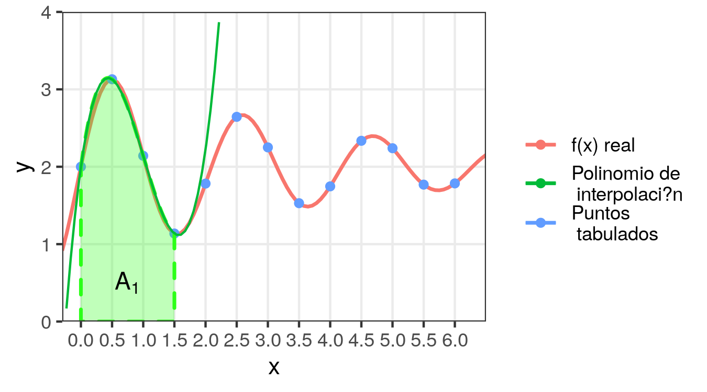
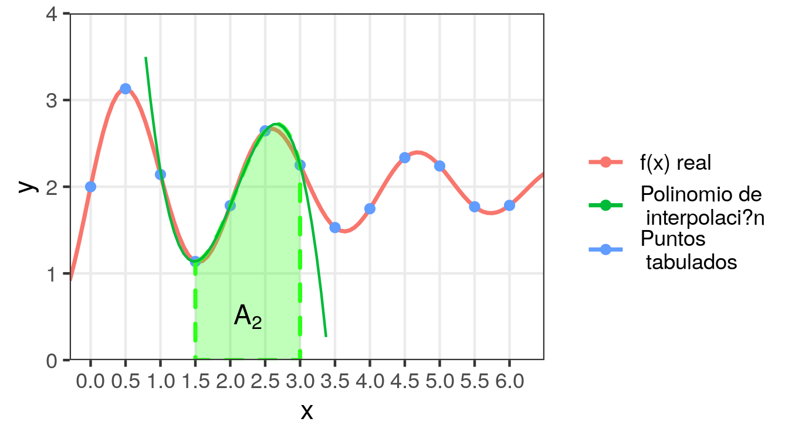
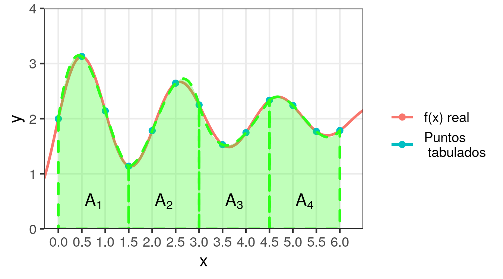

# Aproximación Polinomial: integración y derivación numérica

## Integración numérica

- Dada la función $y = f(x)$ definida en forma tabular con a través de $n+1$ valores de $x$ equiespaciados $x_0, x_1 = x_0 + h, \cdots, x_n = x_0 + nh$, se desea hallar una aproximación de la integral definida:

\begin{equation}
(\#eq:ec1)
\int_{x_0}^{x_n} f(x)dx
\end{equation}

- Para esto, aproximaremos a $f(x)$ con el polinomio de Newton:

\begin{equation}
(\#eq:ec2)
f(x) \cong y_0 + k \Delta y_0 + \frac{k(k-1)}{2!}\Delta^2 y_0 \\
+ \frac{k(k-1)(k-2)}{3!}\Delta^3 y_0 + \cdots
\end{equation}


$$
k = \frac{x-x_0}{h}
$$

- En \@ref(eq:ec1) la variable es $x$, mientras que en \@ref(eq:ec2) la variable está expresada como $k = (x - x_0)/h$, por lo tanto para poder reemplazar \@ref(eq:ec2) en \@ref(eq:ec1) se debe realizar un cambio de variables:

$$
k = \frac{x-x_0}{h} \implies
\begin{cases}
x = x_0 + hk \\
dx = hdk \\
x = x_0 \implies k = \frac{x_0-x_0}{h} = 0 \\
x = x_n \implies k = \frac{x_n-x_0}{h} = \frac{x_0 + nh -x_0}{h} =n \\
\end{cases}
$$

- Luego:

$$
\begin{aligned}
& \int_{x_0}^{x_n} f(x)dx \\
& \cong \int_{0}^{n} \Big( y_0 + k \Delta y_0 + \frac{k(k-1)}{2!}\Delta^2 y_0 + \frac{k(k-1)(k-2)}{3!}\Delta^3 y_0 + \cdots \Big) h\,dk \\
& = h \int_{0}^{n} \Big[ y_0 + k \Delta y_0 + \Big( \frac{k^2}{2} - \frac{k}{2} \Big) \Delta^2 y_0 + \Big( \frac{k^3}{6} - \frac{k^2}{2} + \frac{k}{3} \Big) \Delta^3 y_0  + \cdots \Big] dk \\
&= h \Big[ 
\left.
y_0 k + \frac{k^2}{2} \Delta y_0 + \Big( \frac{k^3}{6} - \frac{k^2}{4} \Big) \Delta^2 y_0 + \Big( \frac{k^4}{24} - \frac{k^3}{6} + \frac{k^2}{6} \Big) \Delta^3 y_0  + \cdots
\Big] \right\vert_{0}^{n} \\
&= h \Big[ y_0 n + \frac{n^2}{2} \Delta y_0 + \Big( \frac{n^3}{6} - \frac{n^2}{4} \Big) \Delta^2 y_0 + \Big( \frac{n^4}{24} - \frac{n^3}{6} + \frac{n^2}{6} \Big) \Delta^3 y_0  + \cdots
\Big]
\end{aligned}
$$

**Ejemplo**. Se tienen los siguientes valores tabulados de $f(x)$ y se desea hallar su integral entre 0 y 6.

| $x$ | $y=f(x)$ |
|:---:|:--------:|
| 0.0 | 2.00     |
| 0.5 | 3.13     |
| 1.0 | 2.14     |
| 1.5 | 1.14     |
| 2.0 | 1.78     |
| 2.5 | 2.64     |
| 3.0 | 2.25     |
| 3.5 | 1.53     |
| 4.0 | 1.75     |
| 4.5 | 2.34     |
| 5.0 | 2.24     |
| 5.5 | 1.77     |
| 6.0 | 1.78     |


```{r, echo=FALSE, out.width = '100%'}

```

La curva roja es la verdadera función $f(x)$ que originó la tabla, la cual suponemos desconocida o difícil de integrar.

### Fórmula trapecial

- Si la interpolación se limita al primer orden y la integral sólo se calcula entre los dos primeros valores de $x$, se obtiene:

\begin{gather*}
\int_{x_0}^{x_1} f(x)dx \cong  \int_{0}^{1} \Big( y_0 + k \Delta y_0 \Big) hdk = h \left. \Big( y_0 k + \frac{k^2}{2} \Delta y_0 \Big) \right\vert_{0}^{1} \\
= h \Big( y_0 + \frac{\Delta y_0}{2} \Big) = h \Big( y_0 + \frac{y_1 - y_0}{2} \Big) = \frac{h}{2} (y_0 + y_1)
\end{gather*}

- En el ejemplo:

$$
\int_{0}^{0.5} f(x)dx \cong  \frac{0.5}{2} (3.13 + 2) = 1.2825
$$

- Geométricamente, esto equivale al área $A_1$ del trapecio formado por la recta de interpolación y el eje de las abscisas, entre $x_0$ y $x_1$:

$$A_2=1.2825$$

```{r, echo=FALSE, out.width = '100%'}

```

- De manera semejante, se puede emplear la interpolación lineal de Newton para obtener una aproximación de la integral entre $x_1$ y $x_2$:

$$
\int_{x_1}^{x_2} f(x)dx \cong A_2 = \frac{h}{2} (y_1 + y_2)
$$


$$A_2=1.3175$$

```{r, echo=FALSE, out.width = '100%'}

```


- Y sucesivamente para todos los intervalos:

$$
\int_{x_{i-1}}^{x_i} f(x)dx \cong A_i = \frac{h}{2} (y_{i-1} + y_i) \quad i = 1, \cdots, n
$$

- De modo que la suma de las áreas de los trapecios $A_i$ resulta ser la aproximación para la integral entre $x_0$ y $x_n$:

$$
\int_{x_{0}}^{x_n} f(x)dx \cong \sum_{i=1}^n A_i = \sum_{i=1}^n \frac{h}{2} (y_{i-1} + y_i) = \frac{h}{2} \Big( y_0 + y_n + 2 \sum_{i = 1}^{n-1} y_i \Big)
$$

- La fórmula hallada se conoce como **fórmula trapecial** y se la simboliza con:

$$
A_{1/2} = \frac{h}{2} \Big( y_0 + y_n + 2 \sum_{i = 1}^{n-1} y_i \Big)
$$

- Cuanto menor sea el ancho de los intervalos $h$ y más se acerque $f(x)$ a una recta dentro de dichos intervalos, mejor será la aproximación así obtenida.
- Gráficamente:

```{r, echo=FALSE, out.width = '85%'}

```

- En el ejemplo: $A_{1/2} = 12.3000$.
- El valor exacto es: $\int_0^{6}f(x)dx = 12.2935$, con lo cual el error relativo de la aproximación con la fórmula trapecial fue: $0.05\%$.

<!--
https://www.integral-calculator.com/
2 + exp((1-x)/4) * sin(4 * x)

http://www.wolframalpha.com/widgets/view.jsp?id=8ab70731b1553f17c11a3bbc87e0b605
2 + exp((1-x)/4) * sin(4 * x)dx

-->

### Fórmula de Simpson de 1/3

- Si la interpolación es de segundo orden y la integral sólo se calcula entre los tres primeros valores de $x$, se obtiene:

$$
\begin{aligned}
\int_{x_0}^{x_2} f(x)dx &\cong  \int_{0}^{2} \Big[ y_0 + k \Delta y_0 + \Big( \frac{k^2}{2} - \frac{k}{2} \Big) \Delta^2 y_0 \Big]  hdk \\
&= h \left. \Big[ y_0 k + \frac{k^2}{2} \Delta y_0  + \Big( \frac{k^3}{6} - \frac{k^2}{4} \Big) \Delta^2 y_0 \Big] \right\vert_{0}^{2} \\
&= h \Big[ 2y_0 + 2 \Delta y_0  + \frac{1}{3} \Delta^2 y_0 \Big]
\end{aligned}
$$

- Dado que $\Delta y_0  = y_1 - y_0$ y $\Delta^2 y_0 = \Delta y_1 - \Delta y_0 = y_2 - 2y_1 + y_0$, nos queda:

$$
\begin{aligned}
\int_{x_0}^{x_2} f(x)dx &\cong h \Big[ 2y_0 + 2 (y_1 - y_0)  + \frac{1}{3} (y_2 - 2y_1 + y_0) \Big] \\
&= \frac{h}{3} (y_0 + 4y_1 + y_2)
\end{aligned}
$$

- Geométricamente, esto equivale al área $A_1$ encerrada entre el eje de las abscisas, $x_0$ y $x_2$ y el polinomio integrador que pasa por $(x_0, y_0)$, $(x_1, y_1)$ y $(x_2, y_2)$: \hspace{3cm} $A_1=2.7766$

```{r, echo=FALSE, out.width = '95%'}

```

- De manera semejante, se puede emplear la interpolación cuadrática de Newton para obtener una aproximación de la integral entre $x_2$ y $x_4$:

$$
\int_{x_2}^{x_4} f(x)dx \cong A_2 = \frac{h}{3} (y_2 + 4y_3 + y_4)
$$

$$A_2=1.4133$$

```{r, echo=FALSE, out.width = '100%'}

```

- Y sucesivamente para todos los intervalos:

$$
\int_{x_{i-1}}^{x_{i+1}} f(x)dx \cong  \frac{h}{3} (y_{i-1} + 4y_i + y_{i+1}) \quad i = 1, 3, 5, \cdots, n-1
$$

- De modo que la suma de estas áreas resulta ser la aproximación para la integral entre $x_0$ y $x_n$:

$$
\int_{x_{0}}^{x_n} f(x)dx \cong \sum\limits_{\substack{i = 1\\ i~impar}}^{n-1} \frac{h}{3} (y_{i-1} + 4y_i + y_{i+1}) = \\ \frac{h}{3} \Big( y_0 + y_n + 2 \sum \limits_{\substack{i = 2\\ i~par}}^{n-2} y_i + 4 \sum\limits_{\substack{i = 1\\ i~impar}}^{n-1} y_i  \Big)
$$

- La fórmula hallada se conoce como **fórmula de Simpson de 1/3** y se la simboliza con:

$$
A_{1/3} = \frac{h}{3} \Big( y_0 + y_n + 2 \sum \limits_{\substack{i = 2\\ i~par}}^{n-2} y_i + 4 \sum\limits_{\substack{i = 1\\ i~impar}}^{n-1} y_i  \Big)
$$

- Para poder aplicarla, es necesario que la cantidad de puntos tabulados sea impar, es decir que la tabla tenga una cantidad par de intervalos.

- Gráficamente:

```{r, echo=FALSE, out.width = '85%'}

```

- En el ejemplo: $A_{1/3} = 12.3833$.
- El valor exacto es: $\int_0^{6}f(x)dx = 12.2935$, con lo cual el error relativo de la aproximación con la fórmula trapecial fue: $7.3\%$.

### Fórmula de Simpson de 3/8

- Si la interpolación es de tercer orden y la integral sólo se calcula entre los 4 primeros valores de $x$, se obtiene:

$$
\hspace{-.25cm}
\begin{aligned}
\int_{x_0}^{x_3} f(x)dx &\cong  \int_{0}^{3} \Big[ y_0 + k \Delta y_0 + \Big( \frac{k^2}{2} - \frac{k}{2} \Big) \Delta^2 y_0  + \Big( \frac{k^3}{6} - \frac{k^2}{2} + \frac{k}{3} \Big) \Delta^3 y_0
\Big]  hdk \\
&= h \left. \Big[ y_0 k + \frac{k^2}{2} \Delta y_0  + \Big( \frac{k^3}{6} - \frac{k^2}{4} \Big) \Delta^2 y_0 + \Big( \frac{k^4}{24} - \frac{k^3}{6} + \frac{k^2}{6} \Big) \Delta^3 y_0 \Big] \right\vert_{0}^{3} \\
&= h \Big[ 3y_0 + \frac{9}{2} \Delta y_0  + \frac{9}{4} \Delta^2 y_0 + \frac{3}{8} \Delta^3 y_0\Big]
\end{aligned}
$$

- Dado que $\Delta y_0  = y_1 - y_0$, $\Delta^2 y_0 = \Delta y_1 - \Delta y_0 = y_2 - 2y_1 + y_0$, y $\Delta^3 y_0 = \Delta^2 y_1 - \Delta^2 y_0 = y_3 - 3y_2 - 3y_1 + y_0$ nos queda:

$$
\begin{aligned}
\int_{x_0}^{x_3} f(x)dx &\cong \frac{3}{8} h (y_0 + 3y_1 + 3y_2+y_3)
\end{aligned}
$$

- Geométricamente, esto equivale al área $A_1$ encerrada entre el eje de las abscisas, $x_0$ y $x_3$ y el polinomio integrador que pasa por $(x_0, y_0)$, $(x_1, y_1)$, $(x_2, y_2)$ y $(x_3, y_3)$:

$$A_1 = 3.5531$$

```{r, echo=FALSE, out.width = '100%'}

```

- De manera semejante, se puede emplear la interpolación cúbica de Newton para obtener una aproximación de la integral entre $x_3$ y $x_6$:

$$
\int_{x_3}^{x_6} f(x)dx \cong A_2 = \frac{3}{8} h (y_3 + 3y_4 + 3y_5 + y_6)
$$

$$A_1 = 3.1219$$

```{r, echo=FALSE, out.width = '100%'}

```

- Y sucesivamente para todos los intervalos:

$$
\int_{x_{i}}^{x_{i+3}} f(x)dx \cong  \frac{3}{8} h (y_{i} + 3y_{i+1} + 3y_{i+2} + y_{i+3}) \quad i = 0, 3, 6, \cdots, n-3
$$

- De modo que la suma de estas áreas resulta ser la aproximación para la integral entre $x_0$ y $x_n$:

$$
\begin{aligned}
\int_{x_{0}}^{x_n} f(x)dx & \cong \sum\limits_{\substack{i = 0\\ ó~i~múltiplo~de~3}}^{n-3} \frac{3}{8} h (y_{i} + 3y_{i+1} + 3y_{i+2} + y_{i+3}) \\
 &= \frac{3}{8} h \Big( y_0 + y_n + 2 \sum \limits_{\substack{i = 3\\ i~múltiplo~de~3}}^{n-3} y_i + 3 \sum\limits_{\substack{i = 1\\ i~no~múltiplo~de~3}}^{n-1} y_i  \Big)
 \end{aligned}
$$

- La fórmula hallada se conoce como **fórmula de Simpson de 3/8** y se la simboliza con:

$$
A_{3/8} = \frac{3}{8} h \Big( y_0 + y_n + 2 \sum \limits_{\substack{i = 3\\ i~múltiplo~de~3}}^{n-3} y_i + 3 \sum\limits_{\substack{i = 1\\ i~no~múltiplo~de~3}}^{n-1} y_i  \Big)
$$

- Para poder aplicarla, es necesario que la cantidad de intervalos en la tabla sea múltiplo de 3.

- Gráficamente:

```{r, echo=FALSE, out.width = '85%'}

```

- En el ejemplo: $A_{3/8} = 12.4088$.
- El valor exacto es: $\int_0^{6}f(x)dx = 12.2935$, con lo cual el error relativo de la aproximación con la fórmula trapecial fue: $9.4\%$.

## Derivación numérica

- Para aproximar la derivada de una función en un punto, nuevamente haremos uso del polinomio interpolador de Newton:

$$
\begin{aligned}
f(x) & \cong y_0 + k \Delta y_0 + \frac{k(k-1)}{2!}\Delta^2 y_0 + \frac{k(k-1)(k-2)}{3!}\Delta^3 y_0 + \cdots \\
&= y_0 + k \Delta y_0 + \Big( \frac{k^2}{2} - \frac{k}{2} \Big) \Delta^2 y_0 + \Big( \frac{k^3}{6} - \frac{k^2}{2} + \frac{k}{3} \Big) \Delta^3 y_0  + \cdots
\end{aligned}
$$

- Se debe derivar con respecto a $x$ el miembro derecho de la expresión anterior, aplicando la Regla de la Cadena ya que $k = (x - x_0)/h$.
- Por simplicidad, lo mostraremos sólo con el polinomio interpolador cuadrático.
- Aproximación de la derivada con el polinomio interpolador cuadrático de Newton:

$$
f(x)  \cong y_0 + k \Delta y_0 + \frac{k^2}{2} \Delta^2 y_0 - \frac{k}{2} \Delta^2 y_0
$$
$$
k = \frac{x-x_0}{h} \implies \frac{\partial k}{\partial x} = \frac{1}{h}
$$

$$
\begin{aligned}
f'(x) & \cong \Delta y_0 \frac{1}{h} + \Delta^2 y_0 ~k~ \frac{1}{h} - \frac{\Delta^2 y_0}{2} \frac{1}{h} \\
& = \frac{1}{h} \Big[ \Delta y_0 + \Big( k-\frac{1}{2} \Big) \Delta^2 y_0 \Big]
\end{aligned}
$$

**Retomando el Ejemplo 1 del capítulo anterior (integración)**: vamos a aproximar el valor de $f'(3.4)$.

| $x_k$ | $y_k$  | $\Delta y_k$ | $\Delta^2 y_k$ | $\Delta^3 y_k$ | $\Delta^4 y_k$ | $\Delta^5 y_k$ |
|-------|--------|--------------|----------------|----------------|----------------|----------------|
| 2     | 0,3010 | 0,1761       | -0,0511        | 0,0230         | -0,0127        | 0,0081         |
| 3     | 0,4771 | 0,1250       | -0,0281        | 0,0103         | -0,0046        | -              |
| 4     | 0,6021 | 0,0969       | -0,0178        | 0,0057         | -              | -              |
| 5     | 0,6990 | 0,0791       | -0,0121        | -              | -              | -              |
| 6     | 0,7781 | 0,0670       | -              | -              | -              | -              |
| 7     | 0,8451 | -            | -              | -              | -              | -              |

\begin{itemize}
    \small
    \item $x = 3,4$
    \item $x_0 = 3$
    \item $h = 1$
    \item $k = \frac{x-x_0}{h} = \frac{3.4-3}{1} = 0.4$
    \item $\Delta y_0 = 0.1250$; $\Delta^2 y_0 = -0.0281$
\end{itemize}

$$
f'(x) \cong \frac{1}{h} \Big[ \Delta y_0 + \Big( k-\frac{1}{2} \Big) \Delta^2 y_0 \Big] = 
 0.1250 + (-0.1) (-0.0281) = 0.12781
$$


Nota: esta fórmula se conoce como *aproximación por diferencias hacia adelante*, pero se pueden lograr aproximaciones más precisas de otras formas, por ejemplo, haciendo que el punto de interés $x$ esté en el centro del rango del polinomio interpolador (*aproximación por diferencias centrales*).

